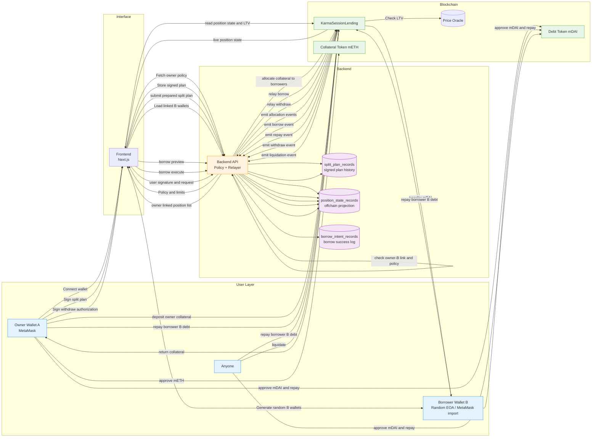
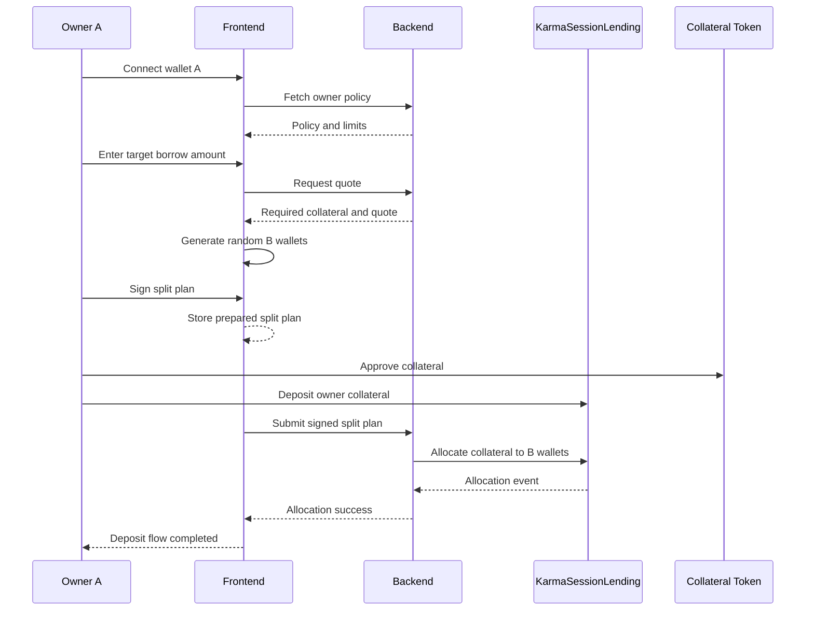

# SplitLend Workspace

Privacy-oriented lending prototype workspace with three apps:

- `karma-lending/`: Foundry contracts and deployment scripts
- `backend/`: NestJS backend for quotes, split-plan verification, relayed execution, and position indexing
- `frontend/`: Next.js frontend for the owner `A` and borrower-wallet `B` flows

## Workspace layout

```text
status_buidl/
├─ karma-lending/
├─ backend/
└─ frontend/
```

## Architecture



## Deposit flow



## Local run order

1. Start Anvil in `karma-lending/`
2. Start Postgres in `backend/`
3. Deploy contracts from `karma-lending/`
4. Fill `backend/.env`
5. Fill `frontend/.env.local`
6. Run backend with `npm run start:dev`
7. Run frontend with `npm run dev`

## Testing with another owner

If you want to test with an additional owner account instead of the default Anvil account `(0)`:

1. In MetaMask, create a new account.
2. Copy the new account address.
3. Fund that address with enough gas ETH and both local test tokens.

The local setup uses three test assets for convenience:

- `ETH`: gas for direct wallet transactions
- `mETH`: mock collateral token used for deposit
- `mDAI`: mock debt token used for repay tests

Run the commands below from `karma-lending/` and replace `<NEW_OWNER_ADDRESS>` with the MetaMask account you created.

```sh
cast send <NEW_OWNER_ADDRESS> \
  --value 100ether \
  --private-key 0xac0974bec39a17e36ba4a6b4d238ff944bacb478cbed5efcae784d7bf4f2ff80 \
  --rpc-url http://127.0.0.1:8545
```

```sh
cast send 0x5FbDB2315678afecb367f032d93F642f64180aa3 \
  "mint(address,uint256)" \
  <NEW_OWNER_ADDRESS> \
  1000000000000000000000000 \
  --private-key 0xac0974bec39a17e36ba4a6b4d238ff944bacb478cbed5efcae784d7bf4f2ff80 \
  --rpc-url http://127.0.0.1:8545
```

```sh
cast send 0xe7f1725E7734CE288F8367e1Bb143E90bb3F0512 \
  "mint(address,uint256)" \
  <NEW_OWNER_ADDRESS> \
  1000000000000000000000000 \
  --private-key 0xac0974bec39a17e36ba4a6b4d238ff944bacb478cbed5efcae784d7bf4f2ff80 \
  --rpc-url http://127.0.0.1:8545
```

After that, connect the new MetaMask account in the frontend and use it as owner `A`.

## App guides

- Contracts: [karma-lending/README.md](/Users/jeong-yoonho/vscode/status_buidl/karma-lending/README.md)
- Backend: [backend/README.md](/Users/jeong-yoonho/vscode/status_buidl/backend/README.md)
- Frontend: [frontend/README.md](/Users/jeong-yoonho/vscode/status_buidl/frontend/README.md)
